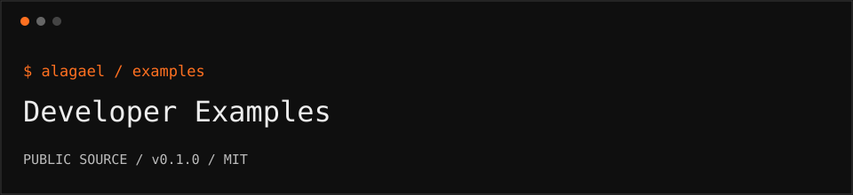

<p></p>

# Developer Examples

Read-only Ethereum factory inspection and disposable cryptographic examples. No deployment keys, wallet connection service, or production app.

```text
repository   github.com/alagael/examples
release      0.1.0 / public beta
audit        not independently audited
support      support@alagael.xyz
```

## Start here

This repository contains **read-only** factory inspection and links to isolated cryptographic samples. It is not the hosted app, a wallet backend, a custody service, or a transaction-signing utility.

```sh
git clone https://github.com/alagael/examples.git
cd examples
pnpm install --frozen-lockfile
pnpm run build
pnpm test
node examples/inspect-factory.mjs
pnpm pack
```

Node.js 22+ and pnpm 10.17.1. No runtime dependencies. `inspect-factory.mjs` reads Ethereum chain ID, bytecode presence, and the factory's implementation link using a public JSON-RPC endpoint.

Set an optional endpoint without placing its value in source control:

```sh
ETHEREUM_RPC_URL=https://ethereum-rpc.publicnode.com node examples/inspect-factory.mjs
```

## Public modules

| Repository | Purpose |
| --- | --- |
| [vault-contracts](https://github.com/alagael/vault-contracts) | Solidity factory and inheritance module |
| [privacy-robe](https://github.com/alagael/privacy-robe) | Local threshold seed-sharing library |
| [herald](https://github.com/alagael/herald) | Time-and-threshold encrypted letters |

Run `examples/roundtrip.mjs` inside the built Privacy Robe repository for an offline sample. Run `examples/inspect-round.mjs` inside the built Herald repository for a UTC round calculation. Only disposable fixtures belong in these examples.

## Public addresses

Ethereum mainnet / chain ID 1:

```text
factory        0xe1906bBFf0c6AE8139b84c713CA60306596FD80f
implementation 0xe821e8E3DE2bA2691437bE5EB69AF0Cd14f3afB9
```

The factory references shared immutable code. Each created switch has separate settings and state. A switch does not hold the user's assets; the associated user-controlled Safe does.

**Never send assets to the factory, implementation, or switch.**

## What inspection does not prove

Code presence and an expected implementation address are not a full bytecode audit. A creation event does not prove Safe owner authorization, an enabled module, a configured guard, a safe heir address, or correct activation. Addresses, balances, and settings are public. These samples do not anonymize Ethereum activity.

The test suite uses mocked RPC responses: wrong-chain, malformed data, missing code, wrong implementation, and RPC errors must fail explicitly. It sends no transactions.

## Packages and community

GitHub releases provide reviewed installable source archives with checksums. No npm-registry publication is implied.

[CONTRIBUTING](CONTRIBUTING.md) · [SECURITY](SECURITY.md) · [RELEASING](RELEASING.md)

MIT. No runtime third-party dependencies are bundled.
